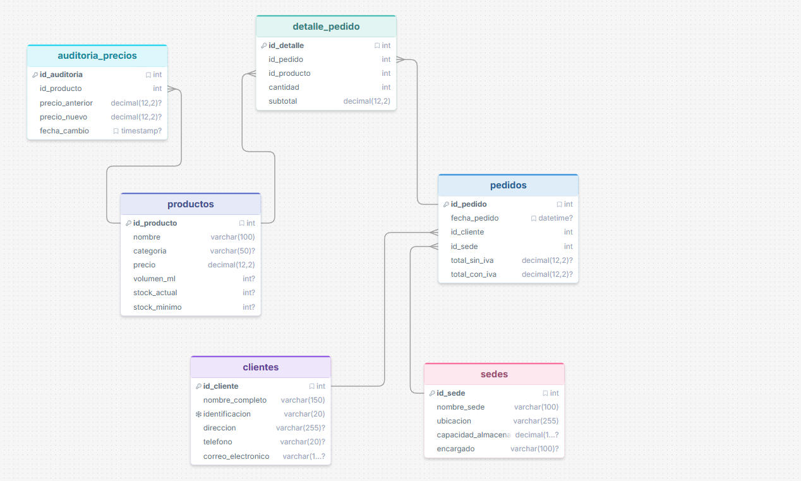

# Gaseosas del Valle S.A. — Sistema de Base de Datos Relacional

## 1. Descripción del Proyecto

**Gaseosas del Valle S.A.** es una distribuidora autorizada de bebidas ubicada en el municipio de Girón, Santander (Colombia), con planes de expansión comercial hacia Bucaramanga y Piedecuesta. Históricamente, la gestión operativa de la empresa —control de inventario, seguimiento de pedidos y registro de clientes— se ha realizado mediante hojas de cálculo, lo que ha generado errores de registro, pérdida de datos y una carencia total de trazabilidad comercial.

El presente proyecto implementa un **sistema de base de datos relacional en MySQL 8.0+** que reemplaza esta gestión manual por un ecosistema modular, transaccional y auditable. El sistema abarca:

- **Gestión integral de productos** con control de precios y umbrales de stock mínimo.
- **Administración de clientes** con identificación tributaria única (NIT/CC).
- **Control de sedes de distribución** (Girón, Bucaramanga, Piedecuesta) con asignación de pedidos por sede.
- **Procesamiento de pedidos** con cálculo automático de IVA (19%) y validación de inventario.
- **Auditoría automática de precios** para trazabilidad regulatoria.
- **Consultas analíticas** para la toma de decisiones comerciales y logísticas.

### Arquitectura de Archivos

| Archivo | Responsabilidad |
|---|---|
| `database.sql` | DDL completo (tablas, restricciones, relaciones) + datos semilla |
| `functions.sql` | Funciones almacenadas: cálculo de IVA y validación de stock |
| `triggers.sql` | Triggers de automatización + recálculo post-seed |
| `views_and_queries.sql` | 4 vistas consolidadas + 9 consultas analíticas |
| `README.md` | Documentación técnica del proyecto |

### Orden de Ejecución

Los scripts deben ejecutarse secuencialmente, respetando las dependencias:

```bash
mysql -u root -p --default-character-set=utf8mb4 < database.sql
mysql -u root -p --default-character-set=utf8mb4 gaseosas_del_valle < functions.sql
mysql -u root -p --default-character-set=utf8mb4 gaseosas_del_valle < triggers.sql
mysql -u root -p --default-character-set=utf8mb4 gaseosas_del_valle < views_and_queries.sql
```

Cada script comienza con `SET NAMES utf8mb4`. El flag `--default-character-set=utf8mb4` evita que el cliente recodifique mal las tildes y la eñe si su charset por defecto es `latin1`. `functions.sql` y `triggers.sql` se pueden volver a ejecutar: eliminan las rutinas anteriores antes de crearlas.

> **Nota de diseño**: Los datos semilla se insertan en `database.sql` *antes* de que los triggers existan. Esto es intencional: evita la doble sustracción de stock. El script `triggers.sql` incluye un `UPDATE` post-seed que recalcula `total_sin_iva` y `total_con_iva` para todos los pedidos usando `fn_calcular_total_con_iva`.

---

## 2. Diagrama Entidad-Relación (ERD)

```
┌──────────────────────┐    ┌──────────────────────┐    ┌──────────────────────┐
│      clientes         │    │        sedes          │    │      productos        │
├──────────────────────┤    ├──────────────────────┤    ├──────────────────────┤
│ PK id_cliente         │    │ PK id_sede            │    │ PK id_producto        │
│    nombre_completo    │    │    nombre_sede        │    │    nombre             │
│    identificacion (UQ)│    │    ubicacion          │    │    categoria          │
│    direccion          │    │    capacidad_almac.   │    │    precio  (CHK ≥ 0)  │
│    telefono           │    │    encargado          │    │    volumen_ml         │
│    correo_electronico │    │                       │    │    stock_actual(CHK≥0)│
└──────────┬───────────┘    └──────────┬───────────┘    │    stock_minimo(CHK≥0)│
           │ 1:N                       │ 1:N            └──────────┬───────────┘
           │                           │                           │ 1:N
           ▼                           ▼                           │
┌──────────┴───────────────────────────┴───────────┐               │
│                    pedidos                         │               │
├────────────────────────────────────────────────────┤               │
│ PK id_pedido                                       │               │
│    fecha_pedido (DATETIME)                         │               │
│ FK id_cliente ──→ clientes (RESTRICT / CASCADE)    │               │
│ FK id_sede    ──→ sedes    (RESTRICT / CASCADE)    │               │
│    total_sin_iva  (DECIMAL 12,2)                   │               │
│    total_con_iva  (DECIMAL 12,2)                   │               │
└────────────────────────┬───────────────────────────┘               │
                         │ 1:N                                       │
                         ▼                                           ▼
┌────────────────────────┴───────────────────────────────────────────┴──┐
│                       detalle_pedidos                                  │
├───────────────────────────────────────────────────────────────────────┤
│ PK id_detalle                                                         │
│ FK id_pedido  ──→ pedidos   (CASCADE  / CASCADE)                      │
│ FK id_producto──→ productos (RESTRICT / CASCADE)                      │
│    cantidad    (INT, CHK > 0)                                         │
│    subtotal    (DECIMAL 12,2, CHK ≥ 0)                                │
└───────────────────────────────────────────────────────────────────────┘

┌──────────────────────────────┐
│      auditoria_precios        │     ← alimentada por tr_auditar_cambio_precio
├──────────────────────────────┤
│ PK id_auditoria               │
│ FK id_producto ──→ productos  │
│    precio_anterior (DEC 12,2) │
│    precio_nuevo    (DEC 12,2) │
│    fecha_cambio   (TIMESTAMP) │
└──────────────────────────────┘
```
Diagrama entidad-relación (DrawSQL):




### Cardinalidades

| Relación | Tipo | Comportamiento FK |
|---|---|---|
| `clientes → pedidos` | 1:N | `ON DELETE RESTRICT` — impide eliminar un cliente con pedidos |
| `sedes → pedidos` | 1:N | `ON DELETE RESTRICT` — impide eliminar una sede con pedidos |
| `pedidos → detalle_pedidos` | 1:N | `ON DELETE CASCADE` — al borrar un pedido, sus líneas se eliminan |
| `productos → detalle_pedidos` | 1:N | `ON DELETE RESTRICT` — impide eliminar un producto vendido |
| `productos → auditoria_precios` | 1:N | `ON DELETE RESTRICT` — impide eliminar un producto auditado |

### Restricciones CHECK (MySQL 8.0.16+)

La tabla `productos` incorpora tres restricciones `CHECK` para garantizar la integridad a nivel de dominio:

```sql
CONSTRAINT chk_precio_positivo      CHECK (precio >= 0)
CONSTRAINT chk_stock_actual_pos     CHECK (stock_actual >= 0)
CONSTRAINT chk_stock_minimo_pos     CHECK (stock_minimo >= 0)
CONSTRAINT chk_cantidad_positiva    CHECK (cantidad > 0)
CONSTRAINT chk_subtotal_no_negativo CHECK (subtotal >= 0)
```

`cantidad > 0` evita líneas de detalle que el trigger de stock interpretaría como una devolución (una cantidad negativa suma inventario).

---

## 3. Explicación Técnica de las Funciones

### 3.1 `fn_calcular_total_con_iva(p_id_pedido INT)`

**Propósito**: Calcular el monto total de un pedido incluyendo el Impuesto al Valor Agregado (IVA) del 19%, vigente en Colombia.

**Lógica interna**:

1. **Agregación**: La función ejecuta `SUM(subtotal)` sobre todas las filas de `detalle_pedidos` que pertenecen al pedido indicado, utilizando `IFNULL(..., 0.00)` para manejar el caso de pedidos sin líneas de detalle.
2. **Cálculo fiscal**: Multiplica el subtotal agregado por el factor `1.19` (base + 19% IVA).
3. **Precisión**: Aplica `ROUND(..., 2)` para garantizar que el resultado se ajuste a dos decimales, evitando errores de redondeo acumulativo en facturación.

**Retorno**: `DECIMAL(12,2)` — total con IVA. Retorna `0.00` si el pedido no tiene detalles o no existe.

**Justificación de diseño**: Se implementa como función determinística (`DETERMINISTIC`, `READS SQL DATA`) para que pueda ser invocada tanto desde triggers como desde consultas `SELECT`, proporcionando un punto centralizado de cálculo fiscal que facilita futuros cambios en la tasa impositiva.

```sql
-- Ejemplo de invocación directa:
SELECT fn_calcular_total_con_iva(1);
-- Resultado: 242760.00  (204000.00 × 1.19)
```

### 3.2 `fn_validar_stock(p_id_producto INT, p_cantidad INT)`

**Propósito**: Verificar la disponibilidad de inventario de un producto antes de confirmar un pedido, actuando como capa de validación preventiva.

**Lógica interna**:

1. **Consulta de inventario**: Recupera `stock_actual` del producto especificado.
2. **Evaluación de existencia**: Si `stock_actual` es `NULL` (el `SELECT INTO` no encontró filas), el producto no existe en el catálogo → retorna `'NO_ENCONTRADO: ...'`.
3. **Comparación de disponibilidad**:
   - Si `stock_actual >= p_cantidad` → retorna `'DISPONIBLE: ...'` con stock actual y cantidad solicitada.
   - Si `stock_actual < p_cantidad` → retorna `'INSUFICIENTE: ...'` indicando el déficit exacto de unidades.

**Retorno**: `VARCHAR(150)` — mensaje descriptivo con el estado y los datos numéricos relevantes. El ancho cubre cantidades de tipo `INT` sin truncar el texto bajo `STRICT_TRANS_TABLES`.

**Justificación de diseño**: Retornar `VARCHAR` en lugar de `BOOLEAN` permite que la capa de aplicación reciba información diagnóstica sin ejecutar consultas adicionales. El mensaje incluye el stock actual, la cantidad solicitada y el déficit (si aplica), facilitando la depuración y la experiencia de usuario en sistemas front-end.

```sql
-- Producto con stock suficiente:
SELECT fn_validar_stock(1, 10);
-- 'DISPONIBLE: Stock actual = 120, solicitado = 10.'

-- Producto con stock insuficiente:
SELECT fn_validar_stock(14, 999);
-- 'INSUFICIENTE: Stock actual = 40, solicitado = 999. Faltan 959 unidades.'

-- Producto inexistente:
SELECT fn_validar_stock(9999, 1);
-- 'NO_ENCONTRADO: El producto no existe en el catálogo.'
```

---

### 3.3 `fn_calcular_promedio_pedidos_cliente(p_id_cliente INT)`

**Propósito**: Calcular el promedio del total sin IVA de todos los pedidos de un cliente.

**Lógica interna**:

1. **Promedio**: Ejecuta `AVG(total_sin_iva)` sobre `pedidos` filtrando por `id_cliente = p_id_cliente`.
2. **Sin pedidos**: Si el cliente no existe o no tiene pedidos, `AVG` devuelve `NULL` y `IFNULL` lo convierte en `0.00`.

**Retorno**: `DECIMAL(12,2)`. Con los datos semilla, cada cliente tiene un solo pedido, así que el promedio coincide con `total_sin_iva` de ese pedido.

```sql
SELECT fn_calcular_promedio_pedidos_cliente(1);
-- 204000.00

SELECT fn_calcular_promedio_pedidos_cliente(99);
-- 0.00
```

## 4. Explicación Técnica de los Triggers

### 4.1 `tr_actualizar_stock` — AFTER INSERT en `detalle_pedidos`

**Propósito**: Automatizar la sustracción de inventario en tiempo real cada vez que se registra una línea de venta, garantizando que `stock_actual` siempre refleje la disponibilidad real.

**Flujo de ejecución detallado**:

```
INSERT INTO detalle_pedidos (...)
        │
        ▼
┌─ tr_actualizar_stock ─────────────────────────┐
│                                                 │
│  1. SELECT stock_actual FROM productos          │
│     WHERE id_producto = NEW.id_producto         │
│        │                                        │
│        ▼                                        │
│  2. ¿stock_actual < NEW.cantidad?               │
│        │                                        │
│    SÍ ─┤─→ SIGNAL SQLSTATE '45000'              │
│        │   MESSAGE = 'Stock insuficiente...'    │
│        │   → Aborta INSERT + ROLLBACK           │
│        │                                        │
│    NO ─┤─→ 3. UPDATE productos                  │
│        │      SET stock_actual -= NEW.cantidad  │
│        │                                        │
│        └─→ 4. UPDATE pedidos                    │
│               SET total_sin_iva = SUM(subtotals)│
│               SET total_con_iva = fn_calc..()   │
└─────────────────────────────────────────────────┘
```

**Mecanismo de protección `SIGNAL SQLSTATE '45000'`**:

El estándar SQL define `SQLSTATE '45000'` como *"unhandled user-defined exception"*. En MySQL, la sentencia `SIGNAL` con este código:

- **Cancela inmediatamente** la operación INSERT que activó el trigger.
- **Revierte** cualquier cambio parcial realizado por el trigger (comportamiento transaccional InnoDB).
- **Propaga** el error al cliente con el `MESSAGE_TEXT` personalizado, permitiendo que la aplicación lo capture via el código de error `1644`.
- **Impide** que `stock_actual` alcance valores negativos, complementando la restricción `CHECK (stock_actual >= 0)` a nivel de DDL.

Esta doble protección (trigger `SIGNAL` + `CHECK` constraint) implementa un patrón de **defensa en profundidad**: el trigger intercepta la operación antes de que llegue a violar el `CHECK`, proporcionando un mensaje de error semántico en lugar del genérico `CHECK constraint violated`.

### 4.2 `tr_auditar_cambio_precio` — BEFORE UPDATE en `productos`

**Propósito**: Mantener un registro histórico inmutable de toda modificación al precio de cualquier producto, cumpliendo con requisitos de trazabilidad y auditoría regulatoria.

**Flujo de ejecución**:

1. **Comparación selectiva**: Evalúa `OLD.precio <> NEW.precio`. Solo inserta un registro de auditoría cuando el precio *realmente* cambia, evitando registros falsos causados por `UPDATE` que modifiquen otros campos sin tocar el precio.
2. **Registro inmutable**: Inserta en `auditoria_precios` el producto afectado, precio anterior, precio nuevo y timestamp exacto via `NOW()`.
3. **Timing `BEFORE`**: Se ejecuta antes de que el `UPDATE` se materialice. Si el trigger falla, el `UPDATE` se cancela, garantizando consistencia.

```sql
-- Ejemplo: actualizar precio de Coca-Cola Original
UPDATE productos SET precio = 4000.00 WHERE id_producto = 1;

-- Registro generado en auditoria_precios:
-- | id_auditoria | id_producto | precio_anterior | precio_nuevo | fecha_cambio        |
-- |            1 |           1 |         3500.00 |      4000.00 | 2026-04-17 12:00:00 |
```

---

## 5. Evidencia de Ejecución — Consultas Analíticas

A continuación se presentan los resultados esperados de las consultas analíticas, calculados a partir de los datos semilla del sistema. Los totales de pedido quedan en cero hasta ejecutar el `UPDATE` final de `triggers.sql`.

### Consulta 1: Productos por debajo del umbral mínimo de stock

```sql
SELECT id_producto, nombre, categoria, stock_actual, stock_minimo,
       (stock_minimo - stock_actual) AS unidades_faltantes
FROM productos
WHERE stock_actual <= stock_minimo
ORDER BY unidades_faltantes DESC;
```

> **Resultado con datos semilla**: Conjunto vacío (`Empty set`).
> Todos los productos fueron cargados con `stock_actual > stock_minimo`. A medida que se registren ventas (trigger `tr_actualizar_stock`), este resultado se irá poblando. Resultado esperado tras operación normal:

```
+-------------+------------------------+-----------+--------------+--------------+-------------------+
| id_producto | nombre                 | categoria | stock_actual | stock_minimo | unidades_faltantes|
+-------------+------------------------+-----------+--------------+--------------+-------------------+
|          14 | Red Bull 250ml         | Energiz.  |            8 |           10 |                 2 |
|          18 | Té Fuze Durazno 400ml  | Tés       |           12 |           15 |                 3 |
+-------------+------------------------+-----------+--------------+--------------+-------------------+
```

### Consulta 2: Pedidos dentro de un rango de fechas (`BETWEEN`)

```sql
SELECT pe.id_pedido, pe.fecha_pedido, c.nombre_completo AS cliente,
       s.nombre_sede AS sede, pe.total_sin_iva, pe.total_con_iva
FROM pedidos pe
JOIN clientes c ON c.id_cliente = pe.id_cliente
JOIN sedes    s ON s.id_sede    = pe.id_sede
WHERE pe.fecha_pedido >= '2026-04-01 00:00:00'
  AND pe.fecha_pedido <  '2026-04-11 00:00:00'
ORDER BY pe.fecha_pedido;
```

> `BETWEEN '2026-04-01' AND '2026-04-10'` compara el `DATETIME` contra `2026-04-10 00:00:00` y excluye el pedido 7 (`2026-04-10 08:00:00`). El límite superior exclusivo del día siguiente incluye esa jornada completa.

```
+-----------+---------------------+---------------------------------+------------------+---------------+---------------+
| id_pedido | fecha_pedido        | cliente                         | sede             | total_sin_iva | total_con_iva |
+-----------+---------------------+---------------------------------+------------------+---------------+---------------+
|         1 | 2026-04-01 08:30:00 | Distribuciones El Valle SAS     | Sede Girón       |     204000.00 |     242760.00 |
|         2 | 2026-04-02 10:15:00 | Tienda Doña Rosa                | Sede Bucaramanga |      80400.00 |      95676.00 |
|         3 | 2026-04-03 14:00:00 | Supermercado La Economía        | Sede Piedecuesta |     179800.00 |     213962.00 |
|         4 | 2026-04-05 09:45:00 | Autoservicio San Martín         | Sede Bucaramanga |     132000.00 |     157080.00 |
|         5 | 2026-04-07 11:00:00 | Cigarrería El Punto             | Sede Girón       |      72200.00 |      85918.00 |
|         6 | 2026-04-08 16:20:00 | MiniMarket Express              | Sede Bucaramanga |     163500.00 |     194565.00 |
|         7 | 2026-04-10 08:00:00 | Cafetería Universidad           | Sede Bucaramanga |     136000.00 |     161840.00 |
+-----------+---------------------+---------------------------------+------------------+---------------+---------------+
7 rows in set
```

### Consulta 3: Productos más vendidos (ranking por cantidad)

```sql
SELECT pr.id_producto, pr.nombre, pr.categoria,
       SUM(dp.cantidad) AS total_unidades_vendidas,
       SUM(dp.subtotal) AS ingresos_totales
FROM detalle_pedidos dp
JOIN productos pr ON pr.id_producto = dp.id_producto
GROUP BY pr.id_producto, pr.nombre, pr.categoria
ORDER BY total_unidades_vendidas DESC, pr.nombre;
```

El desempate es alfabético por nombre. Pony Malta 1.5L no tiene ventas y no aparece.

```
+-------------+----------------------------+--------------+-------------------------+------------------+
| id_producto | nombre                     | categoria    | total_unidades_vendidas | ingresos_totales |
+-------------+----------------------------+--------------+-------------------------+------------------+
|           6 | Agua Cristal 600ml         | Aguas        |                      70 |        140000.00 |
|           1 | Coca-Cola Original         | Gaseosas     |                      64 |        224000.00 |
|           4 | Sprite 600ml               | Gaseosas     |                      33 |         99000.00 |
|           2 | Coca-Cola 1.5L             | Gaseosas     |                      30 |        195000.00 |
|          11 | Pony Malta 330ml           | Maltas       |                      30 |         90000.00 |
|           7 | Agua Cristal 1.5L          | Aguas        |                      25 |         87500.00 |
|          15 | Gatorade Limón 500ml       | Hidratantes  |                      20 |         90000.00 |
|           9 | Jugo Hit Lulo 250ml        | Jugos        |                      20 |         56000.00 |
|          14 | Red Bull 250ml             | Energizantes |                      16 |        120000.00 |
|          16 | Gatorade Naranja 500ml     | Hidratantes  |                      15 |         67500.00 |
|           8 | Jugo Hit Mango 250ml       | Jugos        |                      15 |         42000.00 |
|          10 | Jugo Hit Mora 250ml        | Jugos        |                      15 |         42000.00 |
|          19 | Agua con Gas Manantial 600ml | Aguas      |                      12 |         30000.00 |
|          13 | Colombiana 350ml           | Gaseosas     |                      12 |         37200.00 |
|           3 | Pepsi Lata                 | Gaseosas     |                      12 |         38400.00 |
|           5 | Fanta Naranja 350ml        | Gaseosas     |                      10 |         33000.00 |
|          18 | Té Fuze Durazno 400ml      | Tés          |                      10 |         38000.00 |
|          17 | Té Fuze Limón 400ml        | Tés          |                      10 |         38000.00 |
|          20 | Manzana Postobón 350ml     | Gaseosas     |                       8 |         24800.00 |
+-------------+----------------------------+--------------+-------------------------+------------------+
19 rows in set
```

### Consulta 4: Frecuencia de pedidos por cliente

```sql
SELECT c.id_cliente, c.nombre_completo,
       COUNT(pe.id_pedido) AS cantidad_pedidos,
       IFNULL(SUM(pe.total_con_iva), 0) AS valor_total_compras
FROM clientes c
LEFT JOIN pedidos pe ON pe.id_cliente = c.id_cliente
GROUP BY c.id_cliente, c.nombre_completo
ORDER BY cantidad_pedidos DESC, c.id_cliente;
```

```
+------------+---------------------------------+------------------+---------------------+
| id_cliente | nombre_completo                 | cantidad_pedidos | valor_total_compras |
+------------+---------------------------------+------------------+---------------------+
|          1 | Distribuciones El Valle SAS     |                1 |           242760.00 |
|          2 | Tienda Doña Rosa                |                1 |            95676.00 |
|          3 | Supermercado La Economía        |                1 |           213962.00 |
|          4 | Autoservicio San Martín         |                1 |           157080.00 |
|          5 | Cigarrería El Punto             |                1 |            85918.00 |
|          6 | MiniMarket Express              |                1 |           194565.00 |
|          7 | Cafetería Universidad           |                1 |           161840.00 |
|          8 | Panadería La Estrella           |                1 |            85680.00 |
|          9 | Restaurante Sazón Criollo       |                1 |           214200.00 |
|         10 | Hotel Chicamocha Plaza          |                1 |           324275.00 |
+------------+---------------------------------+------------------+---------------------+
10 rows in set
```

### Consulta 5: Búsqueda de clientes por nombre parcial (`LIKE`)

```sql
SELECT * FROM clientes WHERE nombre_completo LIKE '%market%';
```

```
+------------+------------------+----------------+----------------------------+------------+------------------------+
| id_cliente | nombre_completo  | identificacion | direccion                  | telefono   | correo_electronico     |
+------------+------------------+----------------+----------------------------+------------+------------------------+
|          6 | MiniMarket Express| 900333444-5   | Cra 27 #48-12, Bucaramanga | 3148889900 | express@minimarket.co  |
+------------+------------------+----------------+----------------------------+------------+------------------------+
1 row in set
```

```sql
SELECT * FROM clientes WHERE nombre_completo LIKE 'Tienda%';
```

```
+------------+------------------+----------------+----------------------------+------------+--------------------+
| id_cliente | nombre_completo  | identificacion | direccion                  | telefono   | correo_electronico |
+------------+------------------+----------------+----------------------------+------------+--------------------+
|          2 | Tienda Doña Rosa | 1098765432     | Cll 45 #12-05, Bucaramanga | 3209876543 | donarosa@mail.com  |
+------------+------------------+----------------+----------------------------+------------+--------------------+
1 row in set
```

### Consulta 6: Filtrado de productos por categorías (`IN`)

```sql
SELECT id_producto, nombre, categoria, precio, stock_actual
FROM productos
WHERE categoria IN ('Gaseosas', 'Jugos', 'Energizantes')
ORDER BY categoria, nombre;
```

```
+-------------+------------------------+--------------+---------+--------------+
| id_producto | nombre                 | categoria    | precio  | stock_actual |
+-------------+------------------------+--------------+---------+--------------+
|          14 | Red Bull 250ml         | Energizantes | 7500.00 |           40 |
|           2 | Coca-Cola 1.5L         | Gaseosas     | 6500.00 |           80 |
|           1 | Coca-Cola Original     | Gaseosas     | 3500.00 |          120 |
|          13 | Colombiana 350ml       | Gaseosas     | 3100.00 |           85 |
|           5 | Fanta Naranja 350ml    | Gaseosas     | 3300.00 |           70 |
|          20 | Manzana Postobón 350ml | Gaseosas     | 3100.00 |          100 |
|           3 | Pepsi Lata             | Gaseosas     | 3200.00 |           95 |
|           4 | Sprite 600ml           | Gaseosas     | 3000.00 |          110 |
|           9 | Jugo Hit Lulo 250ml    | Jugos        | 2800.00 |          100 |
|           8 | Jugo Hit Mango 250ml   | Jugos        | 2800.00 |          130 |
|          10 | Jugo Hit Mora 250ml    | Jugos        | 2800.00 |           90 |
+-------------+------------------------+--------------+---------+--------------+
11 rows in set
```

### Consulta 7: Cliente con el mayor número de pedidos (Subconsulta)

```sql
SELECT c.id_cliente, c.nombre_completo, c.identificacion, sub.cantidad_pedidos
FROM clientes c
JOIN (
    SELECT id_cliente, COUNT(*) AS cantidad_pedidos
    FROM pedidos
    GROUP BY id_cliente
    ORDER BY cantidad_pedidos DESC, id_cliente
    LIMIT 1
) sub ON sub.id_cliente = c.id_cliente;
```

```
+------------+-----------------------------+----------------+------------------+
| id_cliente | nombre_completo             | identificacion | cantidad_pedidos |
+------------+-----------------------------+----------------+------------------+
|          1 | Distribuciones El Valle SAS | 900123456-1    |                1 |
+------------+-----------------------------+----------------+------------------+
1 row in set
```

> **Nota**: Con los datos semilla, todos los clientes tienen exactamente 1 pedido. El segundo criterio `id_cliente` hace el resultado determinista y devuelve al cliente 1. Si varios clientes empatan en el máximo, gana el de menor `id_cliente`.

### Consulta 8: Ingresos agrupados por sede

```sql
SELECT s.id_sede, s.nombre_sede,
       COUNT(pe.id_pedido) AS total_pedidos,
       IFNULL(SUM(pe.total_sin_iva), 0) AS ingresos_sin_iva,
       IFNULL(SUM(pe.total_con_iva), 0) AS ingresos_con_iva
FROM sedes s
LEFT JOIN pedidos pe ON pe.id_sede = s.id_sede
GROUP BY s.id_sede, s.nombre_sede
ORDER BY ingresos_con_iva DESC;
```

```
+---------+------------------+---------------+------------------+------------------+
| id_sede | nombre_sede      | total_pedidos | ingresos_sin_iva | ingresos_con_iva |
+---------+------------------+---------------+------------------+------------------+
|       2 | Sede Bucaramanga |             5 |        784400.00 |        933436.00 |
|       1 | Sede Girón       |             3 |        456200.00 |        542878.00 |
|       3 | Sede Piedecuesta |             2 |        251800.00 |        299642.00 |
+---------+------------------+---------------+------------------+------------------+
3 rows in set
```

---

### Consulta 9: Mostrar productos que su precio sea mayor al promedio de todos.

El promedio del catálogo semilla es `75200 / 20 = 3760.00`. La consulta devuelve nombre, categoría y stock, ordenados por precio descendente.

```sql
SELECT nombre, categoria, stock_actual
FROM productos
WHERE precio > (SELECT AVG(precio) FROM productos)
ORDER BY precio DESC, nombre;
```

```
+-------------------------+--------------+--------------+
| nombre                  | categoria    | stock_actual |
+-------------------------+--------------+--------------+
| Red Bull 250ml          | Energizantes |           40 |
| Coca-Cola 1.5L          | Gaseosas     |           80 |
| Pony Malta 1.5L         | Maltas       |           60 |
| Gatorade Limón 500ml    | Hidratantes  |           75 |
| Gatorade Naranja 500ml  | Hidratantes  |           65 |
| Té Fuze Durazno 400ml   | Tés          |           50 |
| Té Fuze Limón 400ml     | Tés          |           55 |
+-------------------------+--------------+--------------+
7 rows in set
```

### Vistas

| Vista | Contenido |
|---|---|
| `vista_resumen_pedidos_por_sede` | Pedidos e ingresos con y sin IVA. Incluye sedes sin ventas (`LEFT JOIN`). |
| `vista_productos_bajo_stock` | Productos con `stock_actual <= stock_minimo`. |
| `vista_clientes_activos` | Clientes con al menos un pedido. |
| `vista_resumen_sedes` | Pedidos, venta sin IVA y promedio por pedido. Solo sedes con ventas (`INNER JOIN`). |

## 6. Recomendaciones para Expansión Futura

### 6.1 Indexación para Escalabilidad

A medida que el volumen de datos crezca, se recomienda crear índices secundarios en las columnas más consultadas para optimizar el rendimiento de las consultas analíticas:

```sql
CREATE INDEX idx_pedidos_fecha     ON pedidos (fecha_pedido);
CREATE INDEX idx_pedidos_cliente   ON pedidos (id_cliente);
CREATE INDEX idx_pedidos_sede      ON pedidos (id_sede);
CREATE INDEX idx_detalle_producto  ON detalle_pedidos (id_producto);
CREATE INDEX idx_productos_cat     ON productos (categoria);
CREATE INDEX idx_productos_stock   ON productos (stock_actual, stock_minimo);
```

### 6.2 API RESTful

Implementar una capa de API (Node.js/Express, Django REST Framework, o Spring Boot) para exponer los servicios del sistema:

- `GET /productos` — catálogo con filtros por categoría y disponibilidad.
- `POST /pedidos` — creación de pedidos con validación de stock previa via `fn_validar_stock`.
- `GET /reportes/ventas-por-sede` — datos consolidados de las vistas.
- `GET /alertas/stock-bajo` — productos bajo umbral mínimo.

### 6.3 Control de Acceso Basado en Roles (RBAC)

Crear roles MySQL con permisos granulares:

- **`rol_vendedor`**: `INSERT` en `pedidos` y `detalle_pedidos`; `SELECT` en `productos` y `clientes`.
- **`rol_administrador`**: Control total sobre todas las tablas.
- **`rol_auditor`**: `SELECT` exclusivamente sobre `auditoria_precios` y las vistas.

### 6.4 Facturación Electrónica

- Incorporar tabla `facturas` con número de resolución DIAN y campos requeridos por la normativa colombiana.
- Integrar con proveedores de facturación electrónica (Carvajal, The Factory HKA, Gosocket).

### 6.5 Módulo de Rutas de Distribución

- Tabla `rutas` para optimizar entregas entre las tres sedes.
- Integración con APIs de geolocalización (Google Maps, OpenStreetMap) para la zona metropolitana de Bucaramanga.

### 6.6 Dashboard en Tiempo Real

- Conectar las vistas existentes a herramientas de BI como Grafana, Metabase o Power BI.
- Implementar alertas automáticas (email/Telegram) cuando `stock_actual` caiga por debajo de `stock_minimo`.

### 6.7 Respaldo y Alta Disponibilidad

- Programar backups automatizados con `mysqldump` via cron (Linux) o Task Scheduler (Windows).
- Configurar replicación maestro-esclavo para tolerancia a fallos.
- Evaluar migración a Amazon RDS o Google Cloud SQL para la expansión a más municipios.

---

*Documentación técnica — Gaseosas del Valle S.A. — Girón, Santander, Colombia*
